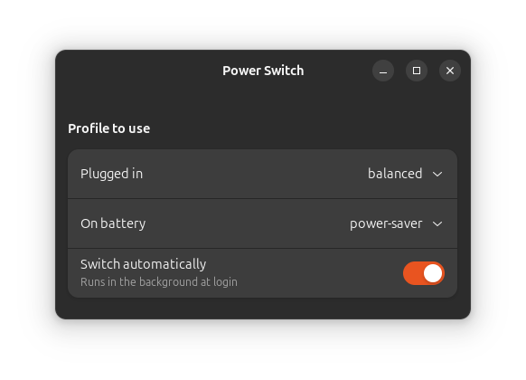
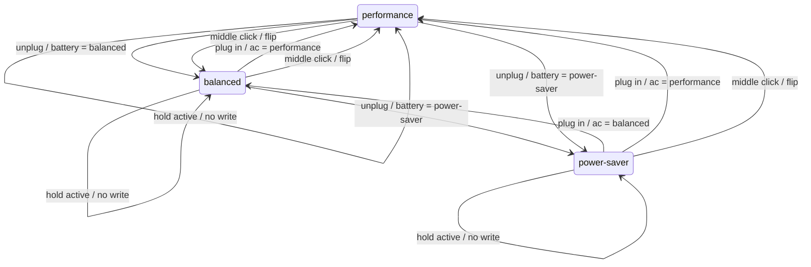
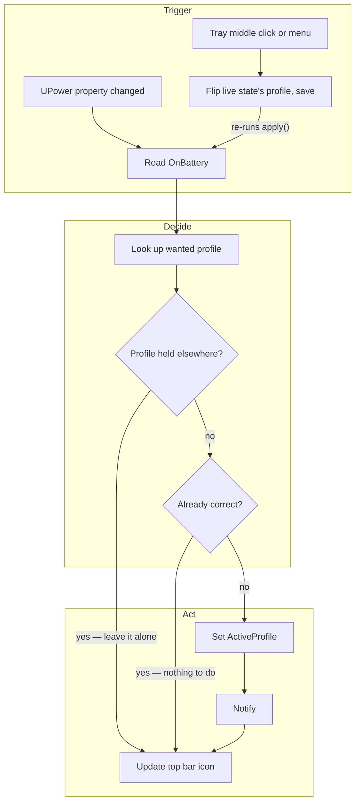

# powerswitch

Switches the GNOME power profile automatically when you plug in or unplug.

GNOME can drop to power-saver on low battery, but it has no setting for
"performance on AC, power-saver on battery". This is that setting.

- **Top bar icon** showing the current profile, with a menu. Middle-click it
  (or use its menu) to flip the current state between performance and balanced.
- **Settings window** (GTK4/libadwaita) to pick the profile for each state.
- **Notification** when the profile changes.

No root, no udev rules, no new packages. It talks to the UPower and
power-profiles-daemon services that Ubuntu already runs, over D-Bus, as
your own user.



## Install

Download the `.deb` from the [latest release](../../releases/latest):

```sh
sudo apt install ./powerswitch_*_all.deb
systemctl --user enable --now powerswitch
```

Or from a clone, which symlinks into your home directory so edits are live:

```sh
git clone https://github.com/mattyv/powerswitch.git
cd powerswitch
./install.sh
```

Either way, open **Power Switch** from the app grid, or run `powerswitch`.

## Using it

The settings window has one dropdown per power state and a switch that
starts or stops the background daemon. Changes apply immediately — the
daemon re-reads its config on every event, so there is nothing to restart.

Defaults are balanced on AC and power-saver on battery. Set either one to
`performance` if you want it, but know that battery drain roughly doubles
and some firmware quietly degrades performance while unplugged (check with
`powerprofilesctl` to see whether yours reports it as degraded).

To check on it, or to turn it off entirely:

```sh
systemctl --user status powerswitch     # is it running, and what did it last do
journalctl --user -u powerswitch -f     # watch it switch
systemctl --user disable --now powerswitch
```

## The three profiles

`power-profiles-daemon` exposes three profiles. Which one you land in
depends only on whether you are plugged in, and on what you configured for
that state:



On the shipped defaults only the two plug/unplug arrows between `balanced`
and `power-saver` ever fire. The rest need `performance` configured — either
in a dropdown, or by middle-clicking the top bar icon, which flips the
profile stored for whichever state you are in right now and keeps it.

The self-loops are the safety property: when another application holds a
profile, powerswitch leaves it alone. GNOME's Automatic Power Saver takes
such a hold when the battery gets low, and games can take one for
performance. Writing the profile would cancel their hold, so it does not.

## What happens on each event



Lid open and close land in this handler too, because `LidIsClosed` sits on
the same UPower interface as `OnBattery`. Both guards short-circuit to the
tray update, so the common case writes nothing at all.

The tray toggle takes the same path. Middle-clicking the icon (or picking
**Toggle performance/balanced** from its menu) rewrites the stored profile
for the state you are in and runs the handler again, so a held profile is
still left alone.

The diagrams above are generated from `.archi/powerswitch.json`; the node
comments in that bundle carry the detail and the `file:line` references.

## Requirements

Ubuntu GNOME with `power-profiles-daemon` active and the AppIndicator
extension enabled (Ubuntu ships both). The tray icon is optional — without
AppIndicator the daemon still switches profiles, it just runs invisibly.

If TLP is running instead of power-profiles-daemon, this does nothing;
TLP has its own AC/battery switching.

## Files

| | |
|---|---|
| `powerswitch` | the whole thing: settings window, and `--daemon` for the watcher |
| `powerswitch.service` | systemd user unit, runs the daemon at login |
| `powerswitch.desktop` | app grid entry |

Config lives in `~/.config/powerswitch.json`. Delete it to get the
defaults back.

## Known limits

Once another application's hold is released, your profile is not restored
until the next plug event. Watching power-profiles-daemon as well would fix
that, at the cost of also reverting profiles you pick by hand in Quick
Settings — the quieter failure was the better trade.
