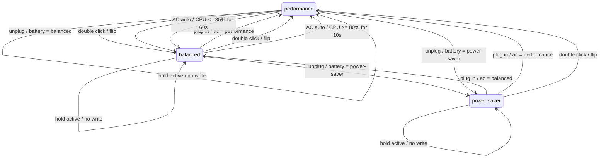
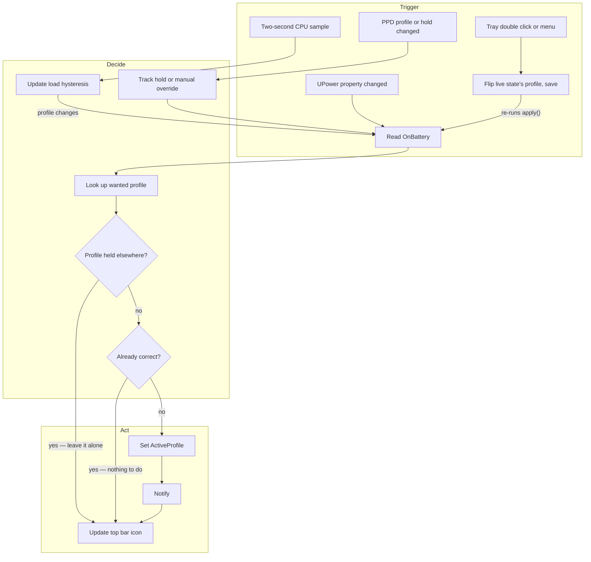

# powerswitch

Switches the GNOME power profile automatically when you plug in or unplug.

GNOME can drop to power-saver on low battery, but it has no setting for
"performance on AC, power-saver on battery". This is that setting.

- **Top bar icon** with a menu showing the current profile. Double-click it
  to flip the current state between performance and balanced (middle-click and
  the menu do the same thing).
- **Settings window** (GTK4/libadwaita) to pick the profile for each state.
- **Optional load-based performance** on AC power, with slow hysteresis so
  short bursts do not make the profile flap.
- **Notification** when the profile changes.

No root, no udev rules, no new packages. It talks to the UPower and
power-profiles-daemon services that Ubuntu already runs, over D-Bus, as
your own user.


## Install

Download the `.deb` from the [latest release](../../releases/latest):

```sh
sudo apt install ./powerswitch_*_all.deb
systemctl --user enable --now powerswitch
```

Or from a clone, which symlinks into your home directory so edits are live:

```sh
git clone https://github.com/mattyv/powerswitch.git
cd powerswitch
./install.sh
```

Either way, open **Power Switch** from the app grid, or run `powerswitch`.

## Using it

The settings window has one dropdown per power state, an optional
**Performance under sustained load** switch, and a switch that starts or stops
the background daemon. Changes apply immediately.

Defaults are balanced on AC and power-saver on battery. Set either one to
`performance` if you want it, but know that battery drain roughly doubles
and some firmware quietly degrades performance while unplugged (check with
`powerprofilesctl` to see whether yours reports it as degraded).

Load-based performance is off by default. When enabled, it applies only while
plugged in. Power Switch samples aggregate CPU use from `/proc/stat` every two
seconds, enters performance after CPU use stays at or above 80% for 10 seconds,
and returns to balanced after it stays at or below 35% for 60 seconds. A
60-second minimum dwell prevents rapid reversals. Aggregate CPU use is already
normalized across the machine's cores; load average is not used because blocked
I/O can raise it without creating CPU demand.

Changing the profile in GNOME Quick Settings pauses load-based switching until
the next plug or unplug. While plugged in, using Power Switch's tray toggle is
stronger: it turns load-based switching off and saves the selected profile.
Suspend and resume clear partial sample streaks, so sleep cannot create a false
transition.

To check on it, or to turn it off entirely:

```sh
systemctl --user status powerswitch     # is it running, and what did it last do
journalctl --user -u powerswitch -f     # watch it switch
systemctl --user disable --now powerswitch
```

## The three profiles

`power-profiles-daemon` exposes three profiles. Power Switch chooses from the
configured AC and battery profiles, plus the optional AC load policy:



On the shipped defaults only the two plug/unplug arrows between `balanced`
and `power-saver` ever fire. The rest need `performance` configured, the AC
load setting enabled, or the tray toggle used.

The self-loops are the safety property: when another application holds a
profile, powerswitch leaves it alone. GNOME's Automatic Power Saver takes
such a hold when the battery gets low, and games can take one for
performance. Writing the profile would cancel their hold, so it does not.
Load-based mode resumes its current decision when the hold is released.

## What happens on each event



Lid open and close land in the UPower handler too, because `LidIsClosed` sits
on the same interface as `OnBattery`. Both guards short-circuit to the tray
update, so the common case writes nothing at all. The load timer calls the
same path only when its hysteresis state changes.

The tray toggle takes the same path. While plugged in, double-clicking the icon
turns load-based mode off. It always rewrites the stored profile for the current
power source and runs the handler again, so a held profile is still left alone.
Middle-click and the menu item do the same.

Double-click needs an `Activate` method, which `libayatana-appindicator` does
not export — GNOME's appindicator extension checks for it and otherwise skips
its double-click handling entirely. So powerswitch publishes its own
`StatusNotifierItem` and keeps the AppIndicator one hidden, purely to borrow
the menu it exports over D-Bus.

The diagrams above are generated from `.archi/powerswitch.json`; the node
comments in that bundle carry the detail and the `file:line` references.

## Requirements

Ubuntu GNOME with `power-profiles-daemon` active and the AppIndicator
extension enabled (Ubuntu ships both). The tray icon is optional — without
AppIndicator the daemon still switches profiles, it just runs invisibly.

If TLP is running instead of power-profiles-daemon, this does nothing;
TLP has its own AC/battery switching.

## Files

| | |
|---|---|
| `powerswitch` | the whole thing: settings window, and `--daemon` for the watcher |
| `test_powerswitch.py` | pure policy, CPU sampling, override, and config tests |
| `powerswitch.service` | systemd user unit, runs the daemon at login |
| `powerswitch.desktop` | app grid entry |

Config lives in `~/.config/powerswitch.json`. Delete it to get the
defaults back. Existing configs remain valid; the optional
`auto_performance_ac` boolean defaults to `false`.

## Known limits

`balanced` already lets the CPU boost for short work. The load-based setting
is useful only when a machine benefits from the platform's sustained
`performance` bias; on other hardware it may add heat and fan noise without a
measurable speedup. This is why the setting remains opt-in.
